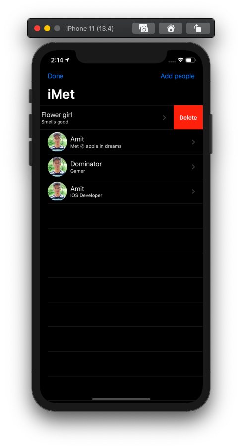

#  iMet

## [#100DaysOfSwiftUI](https://www.hackingwithswift.com/100/swiftui) Day [77](https://www.hackingwithswift.com/100/swiftui/77) to [78](https://www.hackingwithswift.com/100/swiftui/78) Challenge App

## Things i used

1. [UIViewRepresentable](https://www.hackingwithswift.com/books/ios-swiftui/integrating-mapkit-with-swiftui) (For connecting MKMapView with SwiftUI)
2. Custom Annotation View Using [MKAnnotationView](https://developer.apple.com/documentation/mapkit/mapkit_annotations/annotating_a_map_with_custom_data)
3. [FileManager](https://www.hackingwithswift.com/example-code/system/how-to-read-the-contents-of-a-directory-using-filemanager) api for storing data to document directory
4. [CoreLocation LocationManager](https://www.hackingwithswift.com/example-code/location/how-to-request-a-users-location-only-once-using-requestlocation) Api for getting current location of user

